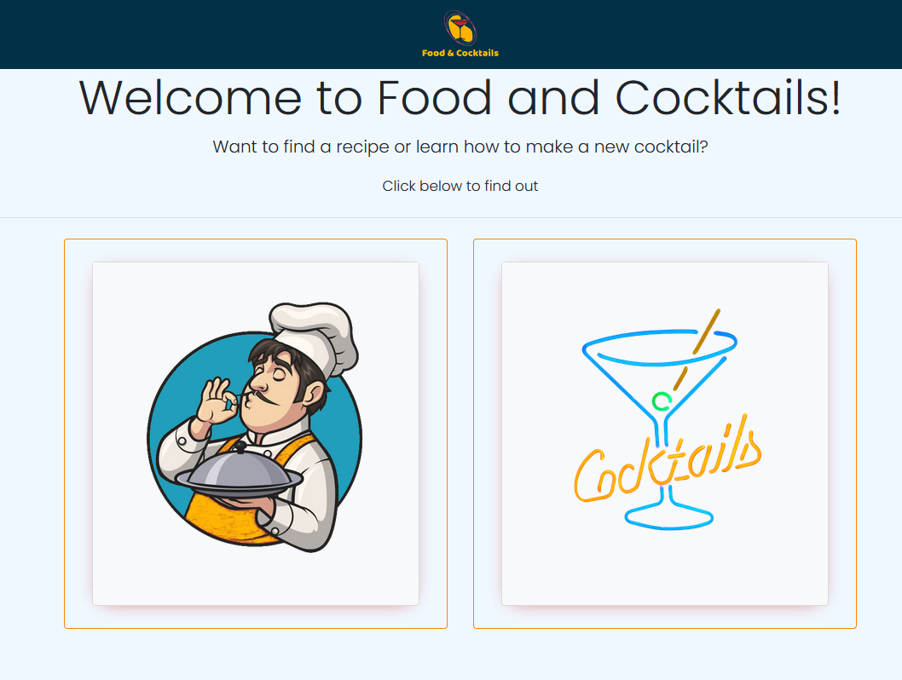
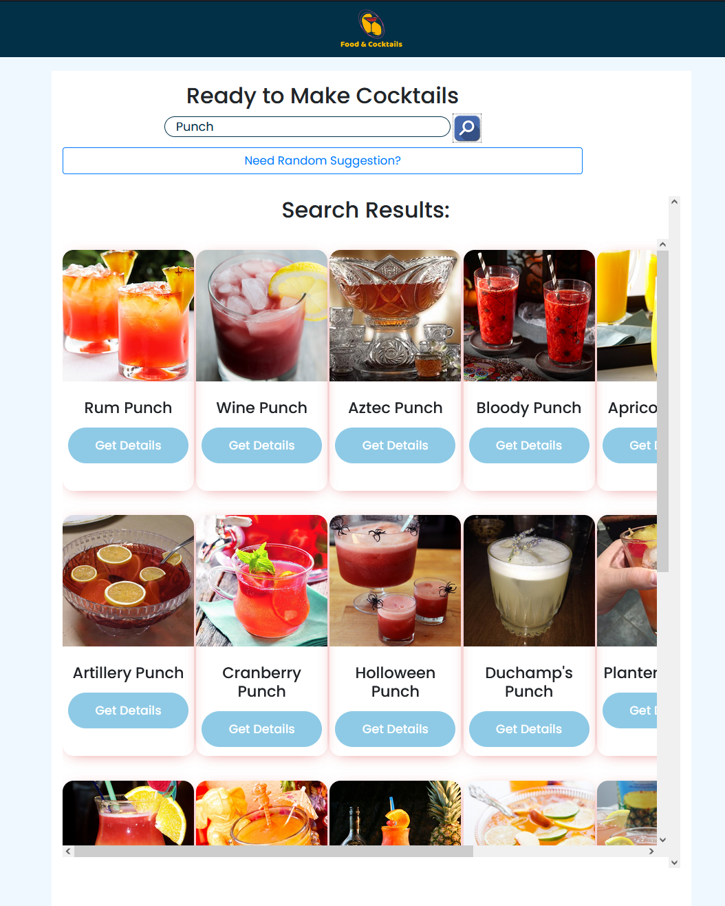
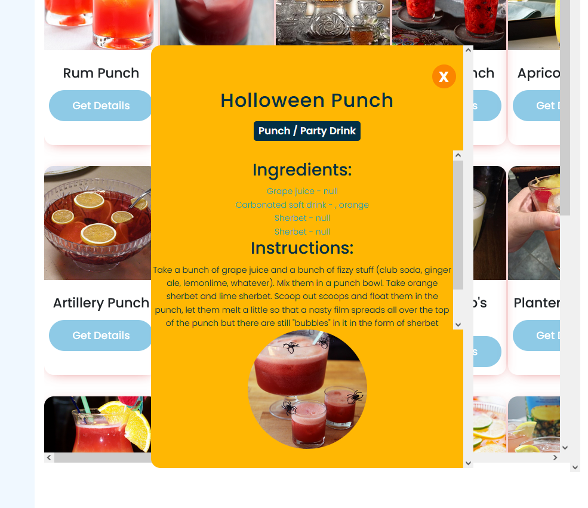

# food-cocktails

## User Story

As a User

I WANT to be able to select if I want to make a meal or a cocktail

SO THAT I can search for a meal or a cocktail and get step by step guide on how to make  it.

## Acceptance Criteria

It's done when:

- The site is build using Bootstrap.

- The app deployed to GitHub Pages.

- The app is interactive (in other words, accept and respond to user input).

- The app uses at least two server-side APIs.

- The app uses client-side storage to store persistent data.

- The app is responsive and has a polished UI.

Welcome to our Food and Cocktails Recipe website! This website provides a collection of delicious cocktail and meal recipes using APIs for you to enjoy. You can find the website at https://kifeakor22.github.io/food-cocktails/.

## Features

Our website includes the following features:

- Easy navigation to find your favorite recipes.

- Separate sections for cocktails and meals, with a wide range of options for any occasion.

- Detailed instructions and ingredient lists for each recipe.

- Ability to search for recipes by name or ingredient.

- Mobile-friendly design, so you can browse recipes on the go.

Credits

The following people have all contributed to this app:

* [AjinThapa2000](https://github.com/AjinThapa2000)
* [Chirbirita](https://github.com/Chirbirita)
* [k-juhi](https://github.com/k-juhi)
